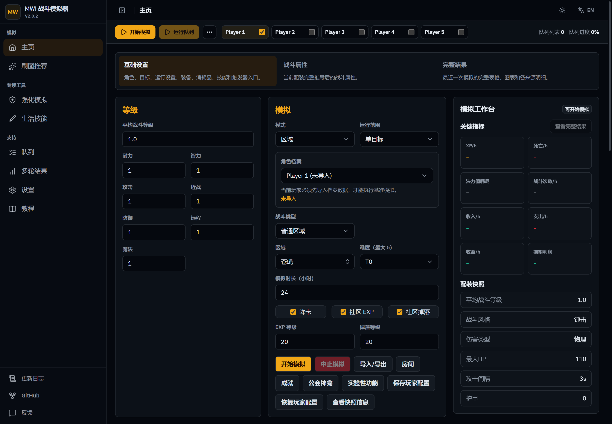
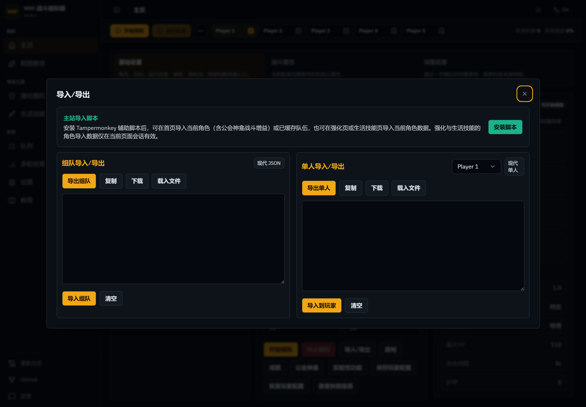
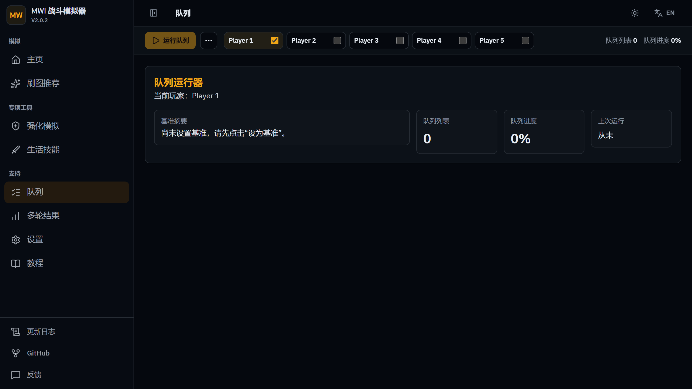

# MWI Combat Simulator User Guide

[中文](user-guide.md)

The project includes complete Chinese and English in-app tutorials. After starting the project, open `#/guide` or click **Guide** in the top navigation. The guide follows the application's global language setting.

> The screenshots in this guide use the Chinese interface. The layout, controls, and workflow are the same when the simulator is displayed in English.

## Recommended Workflow

1. On the Home page, click **Import/Export**, then install the main-site import userscript.
2. Keep the Milky Way Idle main site open and signed in. Return to the simulator and click **Import from Main Site** to import the currently active solo character directly.
3. Only team imports require you to open each teammate's profile on the main site first. This allows the userscript to cache and complete the team data.
4. On the Home page, select the simulation target, scope, difficulty, and duration, then run a combat simulation.
5. Set the current build as the baseline, change the build, add the variant to the queue, and run a multi-round comparison.
6. Use Advisor, Enhancement, or Skilling when you need one of the specialized planning tools.

## Importing Data

The Import/Export window supports the main-site userscript, pasted JSON, and local JSON files. After installing the userscript, a solo character can be imported directly by clicking **Import from Main Site** in the simulator. Only team imports require teammate profiles to be opened on the main site in advance, and the import uses only teammates whose profiles have been opened and cached.

Imported Enhancement and Skilling character data is kept only for the current page session. Refreshing the page requires a new import.

## Queue and Multi-Round Results

Set a baseline first. Then change equipment, abilities, consumables, or other settings and add the variant to the queue. After the queue finishes, use Multi-Round Results to review the overall score, profit and experience changes, stability, cost, and confidence. Results can also be exported to Excel.

> Queue target purchases use the official exact Ask, then a valid official hourly average, then the latest valid archived Ask. The official market is refreshed only when its snapshot is stale; a fresh snapshot without an exact listing proceeds directly to fallback confirmation to avoid a duplicate request. Fallback prices show their source and data time, and a new official listing still wins. Historical prices never affect baseline sale credit, which remains 0 with a warning when no official bid/ask exists.

## Specialized Tools

- **Advisor:** Scans combat targets using Balanced, Profit, Experience, Stability, or custom scoring weights.
- **Enhancement:** Compares protection strategies, Philosopher's Mirror value, decomposition value, cost percentiles, and the probability of success within a budget.
- **Skilling:** Plans level-by-level routes for six skills using Lowest net cost/XP, Balanced, or Speed-first optimization.
- **Settings:** Configures queue scoring, workers, sampling rounds, market price rules, and saved equipment sets.

For more detailed field descriptions, operating steps, and troubleshooting, open the in-app `#/guide` page. Tutorial screenshots are stored in `public/tutorial/` and should be updated whenever the interface changes significantly.
